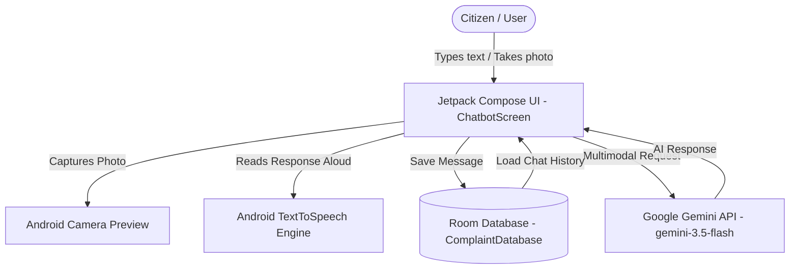

# GovChatbotApp — Project Architecture & Tech Stack Documentation

## Executive Summary
**GovChatbotApp** is a modern Android application designed for civic issue reporting and AI-assisted government service navigation. Powered by Google's Gemini Multimodal AI models, the app enables citizens to interact with a smart assistant using text, speech synthesis, and photo attachments of real-world civic issues (e.g., road damage, waste management, utility failures).

---

## 🛠️ Complete Technology Stack

| Category | Technology / Library | Version / Detail | Role in App |
| :--- | :--- | :--- | :--- |
| **Language** | Kotlin | Modern Idiomatic Kotlin | Primary application development language |
| **UI Framework** | Jetpack Compose | Material 3 Design | Declarative UI for modern, reactive, and responsive screens |
| **AI Core** | Google Gemini API | `generativeai:0.9.0` | Natural Language Understanding & Multimodal analysis (`gemini-3.5-flash`) |
| **Device Integration** | Android Camera API | `ActivityResultContracts` | Captures photos directly from device camera for civic issue reports |
| **Local Persistence** | Android Room Database | `2.6.1` (SQLite backend) | Persists chat history & user complaints locally across sessions |
| **Speech Synthesis** | Android Native `TextToSpeech` | `android.speech.tts.TextToSpeech` | Converts Gemini AI text responses into audible speech |
| **Async & State** | Kotlin Coroutines & StateFlow | `kotlinx-coroutines-android` | Handles background network requests, DB transactions, and smooth UI state updates |
| **Build & Dependency** | Gradle with Kotlin DSL | Gradle 9.1.0 | Dependency management, build optimization, and project configuration |
| **Security Configuration** | Gradle `BuildConfig` | Dynamic injection | Prevents hardcoding sensitive API keys by populating from `local.properties` |

---

## 🏗️ System Architecture & Workflow



---

## 🌟 Key Feature Breakdown

### 1. Multimodal AI Integration (Text + Image)
- **Model**: `gemini-3.5-flash`
- **SDK**: `com.google.ai.client.generativeai.GenerativeModel`
- **Functionality**: Users can attach photos captured via camera. The app bundles both the raw `Bitmap` image data and the user query into a single `content` payload:
  ```kotlin
  val inputContent = content {
      image(bitmap)
      text(query)
  }
  val response = generativeModel.generateContent(inputContent)
  ```

### 2. Camera Capture Integration
- Uses Compose's `rememberLauncherForActivityResult` with `ActivityResultContracts.TakePicturePreview()`.
- Captures compact thumbnail bitmaps efficiently without requiring external storage file write permissions.
- Displays an inline photo preview in the UI prior to sending.

### 3. Local Persistence (Room Database)
- **Entities**: Stores timestamped user messages and assistant responses.
- **DAO (`ComplaintDao`)**: Provides asynchronous suspended functions for insertion and queries using Kotlin Coroutines.
- Ensures messages persist even when the app is restarted or offline.

### 4. Text-To-Speech (TTS) Engine
- Integrated via `android.speech.tts.TextToSpeech`.
- Plays AI responses out loud for improved accessibility.
- Includes lifecycle cleanup (`tts.stop()`, `tts.shutdown()`) to prevent memory leaks.

### 5. Secure Configuration Management
- API Keys are configured in `local.properties`:
  ```properties
  GEMINI_API_KEY=your_gemini_api_key_here
  ```
- Inject automatically into code via `build.gradle.kts`:
  ```kotlin
  buildFeatures { buildConfig = true }
  defaultConfig {
      buildConfigField("STRING", "GEMINI_API_KEY", "\"$geminiKey\"")
  }
  ```

---

## 📁 Key File Structure

```
GovChatbotApp/
 ├── app/
 │   ├── build.gradle.kts           # App-level dependencies & BuildConfig setup
 │   └── src/main/java/com/example/govchatbotapp/
 │       ├── data/
 │       │   ├── ComplaintDatabase.kt# Room DB configuration
 │       │   └── ComplaintDao.kt     # Room Data Access Object
 │       ├── ui/
 │       │   └── screens/
 │       │       └── ChatbotScreen.kt# Main UI, Gemini API, Camera & TTS logic
 │       └── MainActivity.kt        # Main Entry Point & Theme Wrapper
 ├── local.properties               # Environment variables (API Keys)
 └── build.gradle.kts               # Project-level Gradle build file
```

---

## 🚀 Future Roadmap & Enhancements
1. **High-Res Photo Storage**: Storing full-resolution photos locally using `FileProvider` and saving file URIs in Room.
2. **Backend API Synchronization**: Syncing offline Room complaints with a central Government portal backend.
3. **Location Tagging**: Adding GPS geolocation tagging to civic issue photos for exact problem mapping.
